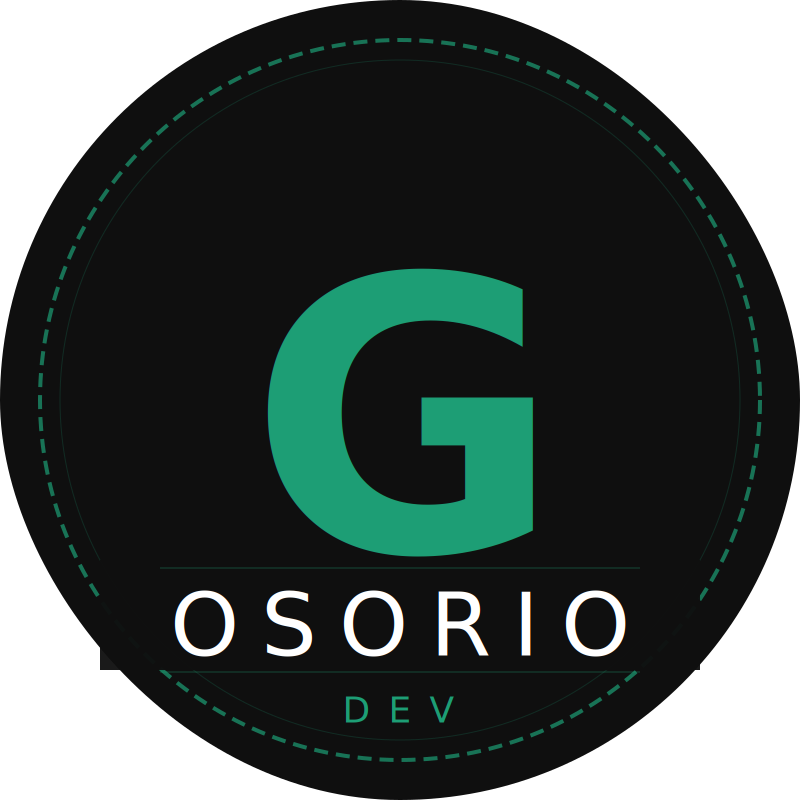

# CSDD Templates — @GustavoOsorioDev

> **Contract-first Spec-Driven Development**  
> Ingeniería real. Sin vibes.

CSDD es una metodología diseñada para elevar la calidad del desarrollo asistido por IA. El "vibe coding" genera código que parece funcionar; la ingeniería real genera código que funciona porque respeta un contrato previo.

---

## 📂 Estructura del Ecosistema

Este repositorio contiene las plantillas maestras y ejemplos reales para implementar CSDD en cualquier proyecto.

### 📄 Las Plantillas (Raíz)
Úsalas como base para cualquier nuevo proyecto:

1.  **[CONSTITUTION.md](CONSTITUTION.md)**: El manifiesto. Define los principios no negociables y las reglas de interacción humano-IA.
2.  **[contracts.md](contracts.md)**: El centro de gravedad. Contiene tipos, interfaces, contratos de API y reglas de validación.
3.  **[spec.md](spec.md)**: El "qué". Historias de usuario con criterios de aceptación binarios y casos de error.
4.  **[plan.md](plan.md)**: El "cómo". Stack tecnológico, estructura de archivos y decisiones de arquitectura.
5.  **[tasks.md](tasks.md)**: La ejecución. Desglose de tareas atómicas diseñadas para ser consumidas por agentes de IA.

### 🚀 El Ejemplo Completo
Mira cómo se aplican las 5 fases en un proyecto real:
*   **[TaskFlow API Example](examples/taskflow-api/)**: Una API robusta diseñada bajo CSDD.

---

## 🛠️ ¿Por qué CSDD?

La diferencia entre un proyecto que escala y uno que se convierte en spaghetti no está en qué tan avanzada es la IA que usas, sino en si tienes un **contrato** antes de tocar el teclado.

*   **IA como ejecutora, no arquitecta**: El humano diseña el contrato, la IA implementa contra él.
*   **Cero Alucinaciones**: Al tener contratos explícitos, el agente no tiene que "adivinar" librerías o tipos.
*   **Definición de "Hecho" Binaria**: Una tarea está lista solo si cumple los criterios de aceptación y el contrato.

---

## 📺 Sigue el Movimiento

Aprende a construir proyectos reales usando esta metodología en mi canal:
👉 **[@GustavoOsorioDev en YouTube](https://www.youtube.com/@GustavoOsorioDev)**

Si este repositorio te ayuda a elevar tu nivel de ingeniería, dale una ⭐.

---
Gustavo Osorio — @GustavoOsorioDev  
*Ingeniería real. Sin vibes.*
